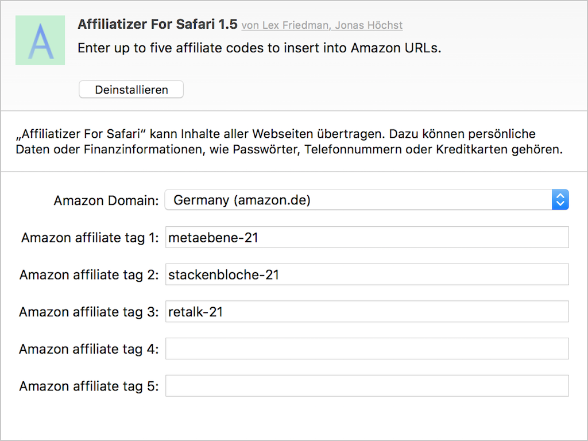

# Affiliatizer for Safari
A Safari plug-in for automatically adding the affiliate codes of your choice to Amazon URLs you encounter around the internet:

1. select local amazon **domain** (amazon.com, amazon.de, ...)
2. enter up to five **affiliate tags**
3. **donate** amazon affiliate money to your favourite websites, blogs and podcasts!

### Installation 

Download latest release from [GitHub Affiliatizer Releases Page](https://github.com/jonashoechst/Affiliatizer.safariextension/releases/latest) and double click to add to Safari.

### Configuration Interface

